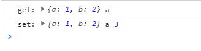
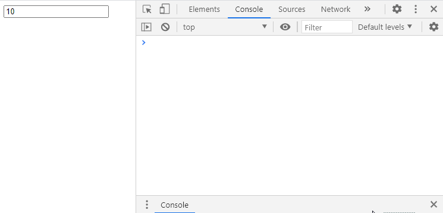
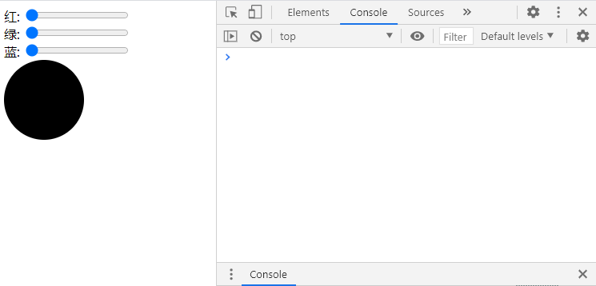

# 第十二周 编程与算法训练-Proxy与双向绑定

本周学习目标，了解proxy的基本用发并使用proxy实现vue3.0中的reactive特性   

## Proxy 的基本使用
Proxy 对象用于定义基本操作的自定义行为（如属性查找、赋值、枚举、函数调用等）   
```javascript
// 使用proxy代理一个对象
let obj = {
  a: 1,
  b: 2,
}

let proxy = new Proxy(obj, {
  // 拦截获取属性 obje.xx
  get(obj, prop) {
    console.log('get:', obj, prop);
  },
  // 拦截设置属性 obje.xx = xxx
  set(obj, prop, val) {
    console.log('set:', obj, prop, val);
  }
});

proxy.a; // 1.html:18 get: {a: 1, b: 2} a
proxy.a = 3; // set: {a: 1, b: 2} a 3
```
   
Proxy拦截器还包含`has` `deleteProperty` `ownKeys` `apply` `construct` 等。   
[MDN文档地址]: https://developer.mozilla.org/zh-CN/docs/Web/JavaScript/Reference/Global_Objects/Proxy  

## 模仿vue3.0 reactive实现一
实现reactive函数   
```javascript
let p1 = reactive({
  a: 1,
  b: 2
});

// reactive 函数定义 将Proxy封装
function reactive(object) {
  return new Proxy(object, {
    get(obj, prop) {
      return obj[prop];
    },
    set(obj, prop, val) {
      obj[prop] = val;
      return obj[prop];
    }
  });
}
```

## 模仿vue3.0 reactive实现二 
增加监听函数`effect`   
```javascript

let p1 = reactive({
  a: 1,
  b: 2
});

let callbacks = [];

function reactive(object) {
  return new Proxy(object, {
    get(obj, prop) {
      return obj[prop];
    },
    set(obj, prop, val) {
      obj[prop] = val;
      // 执行保存的回调函数
      for (let call of callbacks) {
        call && call();
      }
      return obj[prop];
    }
  });
}

function effect(callback) {
  // 将回调函数保存
  callbacks.push(callback);
}

effect(() => {
  console.log('effect');
});

p1.a = 10; // effect 10
```
> 在p1进行赋值时候会执行effect中的回调函数

## 模仿vue3.0 reactive实现三
将`effect`和`reactive`建立关联   
```javascript
let callbacks = new Map();
let usedReactiveties = [];
let p1 = reactive({
  a: 1,
  b: 2,
});

function reactive(object) {
  return new Proxy(object, {
    get(obj, prop) {
      usedReactiveties.push([obj, prop]);
      return obj[prop];
    },
    set(obj, prop, val) {
      obj[prop] = val;

      if (callbacks.get(obj)) {
        if (callbacks.get(obj).get(prop)) {
          // 执行保存的effect回调函数
          for (let call of callbacks.get(obj).get(prop)) {
            call && call();
          }
        }
      }

      return obj[prop];
    }
  });
}

function effect(callback) {
  usedReactiveties = [];
  callback();

  for(let reactive of usedReactiveties) {
    // 空状态处理
    if (!callbacks.has(reactive[0])) {
      callbacks.set(reactive[0], new Map());
    }
    if (!callbacks.get(reactive[0]).has(reactive[1])) {
      callbacks.get(reactive[0]).set(reactive[1], []);
    }
    // 将回调函数加入到reactive中
    callbacks.get(reactive[0]).get(reactive[1]).push(callback);
  }
}

effect(() => {
  console.log('effect', p1.a);
});
```
> 当修改p1.a属性 会触发effect中的回调函数

当对象有多层属性的时候`obj.xx.xx`上面实现代码并不能触发`effect`函数，接下来我们就需要实现对象深度监听   

## 模仿vue3.0 reactive实现四
在`Proxy get`拦截器中增加一层判断，当属性为对象`Object`则直接返回一个新的`Proxy`   
```javascript
get(obj, prop) {
  usedReactiveties.push([obj, prop]);
  if (typeof obj[prop] === 'object') {
    return reactive(obj[prop]);
  }
  return obj[prop];
},
```
同时再增加一层proxy缓存，在创建`proxy`之前查看是否有缓存有则使用缓存   
```javascript
let reactivties = new Map();

function reactive(object) {
  // 判断是否有缓存proxy
  if (reactivties.has(object)) {
    return reactivties.get(object);
  }
  let proxy = new Proxy(object, {
    get(obj, prop) {
      usedReactiveties.push([obj, prop]);
      if (typeof obj[prop] === 'object') {
        return reactive(obj[prop]);
      }
      return obj[prop];
    },
    set(obj, prop, val) {
      obj[prop] = val;

      if (callbacks.get(obj)) {
        if (callbacks.get(obj).get(prop)) {
          // 执行保存的回调函数
          for (let call of callbacks.get(obj).get(prop)) {
            call && call();
          }
        }
      }

      return obj[prop];
    }
  });
  
  // 缓存当前proxy
  reactivties.set(object, proxy);

  return proxy;
}
```
完整代码：
```javascript
let obj = {
  a: 1,
  b: 2,
}

let callbacks = new Map();
let reactivties = new Map();
let usedReactiveties = [];
let p1 = reactive(obj);

function reactive(object) {
  if (reactivties.has(object)) {
    return reactivties.get(object);
  }
  let proxy = new Proxy(object, {
    get(obj, prop) {
      usedReactiveties.push([obj, prop]);
      if (typeof obj[prop] === 'object') {
        return reactive(obj[prop]);
      }
      return obj[prop];
    },
    set(obj, prop, val) {
      obj[prop] = val;

      if (callbacks.get(obj)) {
        if (callbacks.get(obj).get(prop)) {
          // 执行保存的回调函数
          for (let call of callbacks.get(obj).get(prop)) {
            call && call();
          }
        }
      }

      return obj[prop];
    }
  });
  
  reactivties.set(object, proxy);

  return proxy;
}

function effect(callback) {
  // 将回调函数保存
  // callbacks.push(callback);
  usedReactiveties = [];
  callback();

  for(let reactive of usedReactiveties) {
    if (!callbacks.has(reactive[0])) {
      callbacks.set(reactive[0], new Map());
    }
    if (!callbacks.get(reactive[0]).has(reactive[1])) {
      callbacks.get(reactive[0]).set(reactive[1], []);
    }
    callbacks.get(reactive[0]).get(reactive[1]).push(callback);
  }
}

effect(() => {
  console.log('effect', p1.a);
  console.log('effect', p1.b);
});
```

## reactive应用场景-双向绑定
简单的`input`双向绑定   
```html
<input type="text" id="r" value="">
<script>
  
  let callbacks = new Map();
  let reactivties = new Map();
  let usedReactiveties = [];

  let p1 = reactive({
    val: 10
  });

  effect(() => {
    // val发生变化时自动设置input值
    document.getElementById('r').value = p1.val;
  })

  function reactive(object) {
    if (reactivties.has(object)) {
      return reactivties.get(object);
    }
    let proxy = new Proxy(object, {
      get(obj, prop) {
        usedReactiveties.push([obj, prop]);
        if (typeof obj[prop] === 'object') {
          return reactive(obj[prop]);
        }
        return obj[prop];
      },
      set(obj, prop, val) {
        obj[prop] = val;

        if (callbacks.get(obj)) {
          if (callbacks.get(obj).get(prop)) {
            // 执行保存的回调函数
            for (let call of callbacks.get(obj).get(prop)) {
              call && call();
            }
          }
        }

        return obj[prop];
      }
    });
    
    reactivties.set(object, proxy);

    return proxy;
  }

  function effect(callback) {
    // 将回调函数保存
    // callbacks.push(callback);
    usedReactiveties = [];
    callback();

    for(let reactive of usedReactiveties) {
      if (!callbacks.has(reactive[0])) {
        callbacks.set(reactive[0], new Map());
      }
      if (!callbacks.get(reactive[0]).has(reactive[1])) {
        callbacks.get(reactive[0]).set(reactive[1], []);
      }
      callbacks.get(reactive[0]).get(reactive[1]).push(callback);
    }
  }

</script>
```
   

## reactive应用场景-调色板案例

```html
<div>
  红: <input type="range" id="r" value="" min="0" max="255">
</div>
<div>
  绿: <input type="range" id="g" value="" min="0" max="255">
</div>
<div>
  蓝: <input type="range" id="b" value="" min="0" max="255">
</div>
<div style="width: 100px; height: 100px;border-radius: 50%;" id='color'></div>
<style>
  input{
  }
</style>
<script>
  
  let callbacks = new Map();
  let reactivties = new Map();
  let usedReactiveties = [];

  let p1 = reactive({
    r: 0,
    g: 0,
    b: 0,
  });

  const $ = (el) => {
    return document.querySelector(el);
  }

  effect(() => {
    $('#r').value = p1.r;
  });
  effect(() => {
    $('#g').value = p1.g;
  });
  effect(() => {
    $('#b').value = p1.b;
  });

  $('#r').addEventListener('input', event => p1.r = event.target.value);
  $('#g').addEventListener('input', event => p1.g = event.target.value);
  $('#b').addEventListener('input', event => p1.b = event.target.value);

  effect(() => {
    $('#color').style.backgroundColor = `rgb(${p1.r}, ${p1.g}, ${p1.b})`;
  });

  function reactive(object) {
    if (reactivties.has(object)) {
      return reactivties.get(object);
    }
    let proxy = new Proxy(object, {
      get(obj, prop) {
        usedReactiveties.push([obj, prop]);
        if (typeof obj[prop] === 'object') {
          return reactive(obj[prop]);
        }
        return obj[prop];
      },
      set(obj, prop, val) {
        obj[prop] = val;

        if (callbacks.get(obj)) {
          if (callbacks.get(obj).get(prop)) {
            // 执行保存的回调函数
            for (let call of callbacks.get(obj).get(prop)) {
              call && call();
            }
          }
        }

        return obj[prop];
      }
    });
    
    reactivties.set(object, proxy);

    return proxy;
  }

  function effect(callback) {
    // 将回调函数保存
    // callbacks.push(callback);
    usedReactiveties = [];
    callback();

    for(let reactive of usedReactiveties) {
      if (!callbacks.has(reactive[0])) {
        callbacks.set(reactive[0], new Map());
      }
      if (!callbacks.get(reactive[0]).has(reactive[1])) {
        callbacks.get(reactive[0]).set(reactive[1], []);
      }
      callbacks.get(reactive[0]).get(reactive[1]).push(callback);
    }
  }

</script>
```
   

## reactive应用场景-Range实现精准拖拽案例

